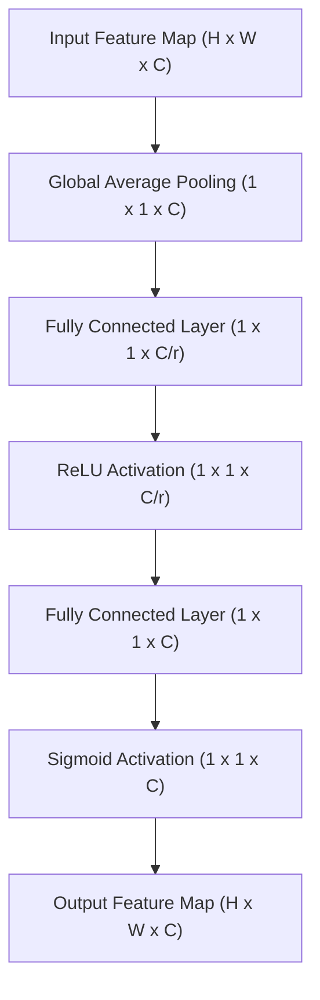
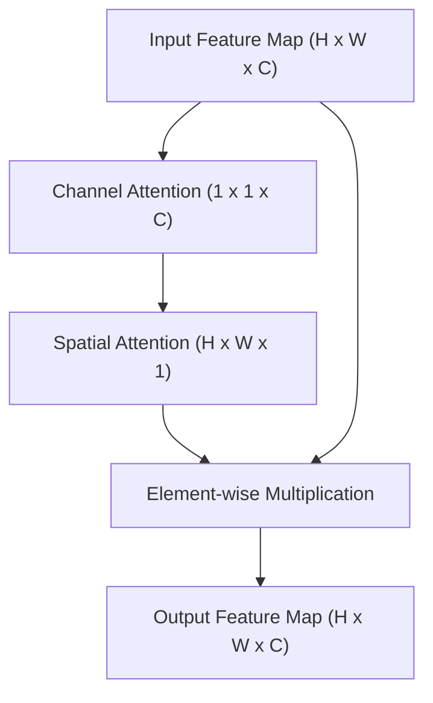
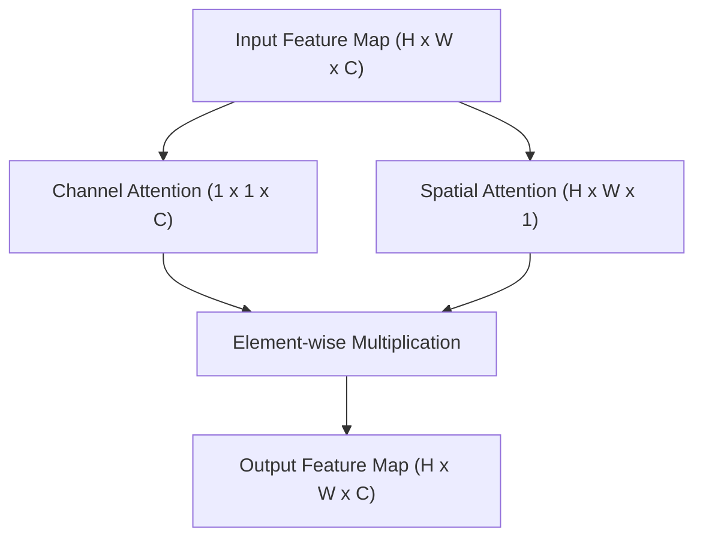
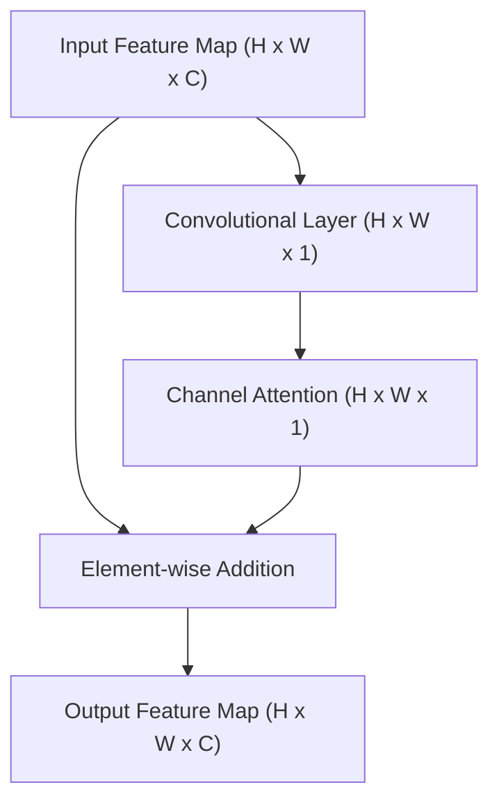

# SE

## Explanation
https://towardsdatascience.com/squeeze-and-excitation-networks-9ef5e71eacd7

Diagram by ChatGPT:

## Ideas
### Squeeze

| Parameter       | Tested Values            | Selected Value | To Try                        |
|:--------------- |:------------------------ |:-------------- |:----------------------------- |
| Reduction ratio | 2, 4, 8, 16, 32          | 16             |                               |
| Operation       | max pooling, avg pooling | avg pooling    | More sophisticated techniques |

### Excitation

### General

| Parameter     | Tested Values       | Selected Value | To Try |
|:------------- |:------------------- |:-------------- |:------ |
| Non linearity | ReLU, Tanh, Sigmoid | Sigmoid        |        |

# CBAM

## Explanation

https://medium.com/visionwizard/understanding-attention-modules-cbam-and-bam-a-quick-read-ca8678d1c671

Diagram by ChatGPT:

## Ideas
### Channel attention
  * MLP
    * Number of hidden layers (1)
    * Size of hidden layer(s) or reduction ratio C/r (r=16)
    * max pooled + avg pooled feature maps. can we add / replace them with other methods?
    * Weights are shared for both max pooled and avg pooled feature maps

### Spatial attention
  * Generation - avg&max pooling better than 1x1 conv
  * filter size (7) - they found out it is better than smaller ones
* Arrangement - they found out best is channel → spatial
* Merging the two modules using element-wise summation, no learnable parameters

# BAM

## Explanation
https://medium.com/visionwizard/understanding-attention-modules-cbam-and-bam-a-quick-read-ca8678d1c671

Diagram by ChatGPT:

## Ideas

# ECA
> Explanation: https://blog.paperspace.com/attention-mechanisms-in-computer-vision-ecanet/

Diagram by ChatGPT:

## Ideas

# General Ideas

* Architetcures to put the mosules in
* where in the network to put them
* combining modules, repeating modules
* usage for different tasks
